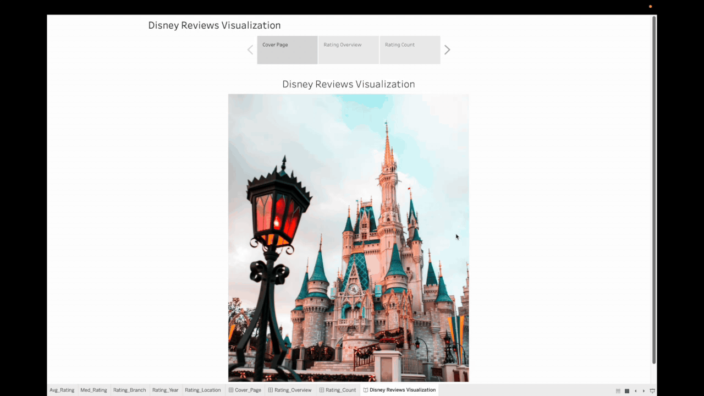
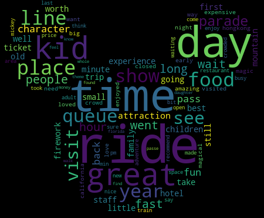
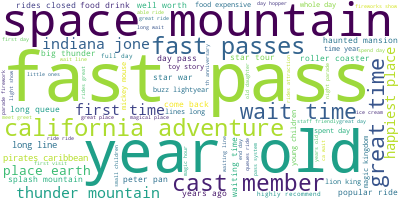

# Topic Modeling Disney Reviews 

-   Author: Amelia Tang 

## About
TBU Disney land is regarded as "The Happiest Place on Earth" by many according to U.S. News Travel (Anonymous 2021). This Natural Language Processing (NLP) project is to visualize and analyze the Disneyland Reviews data set I collected from [Kaggle](https://www.kaggle.com/datasets/arushchillar/disneyland-reviews). The data set contains about 42,000 reviews of Three Disneyland locations: Paris, California and Hong Kong. In the project, I used sentiment analysis ....    

## Reports
TBU

## Visualizations 

### Tableau 

### WordCloud 
#### Unigram WordCloud

#### Bigram WordCloud

### Clusters 

## Usage

### Creating the environment

At the project root
`conda env create --file topic_modeling_disney.yaml`

 Run the following command from the environment where you installed
JupyterLab.

`conda install nb_conda_kernels`

## Dependencies

[TBU]A complete list of dependencies is available [here](TBU).
 - Python 3.10.8 and Python packages:  - docopt=0.6.2  -
altair=4.2.0  - altair_data_server=0.4.1  - scikit-learn=1.2.0  - xgboost=1.7.1

## References 
Anonymous. 2021. “Disneyland Resort Reviews | U.S. News Travel.” "https://travel.usnews.com/Anaheim_Disneyland_CA/Things_To_Do/Disneyland_62335/".
